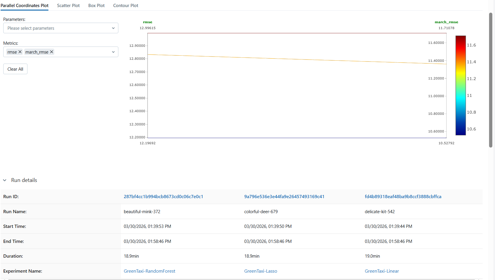

# Practice 4: MLOps Fundamentals - Training & Registry - Calvin Saragih

## 1. Introduction
This report details the implementation of an end-to-end MLOps pipeline for Green Taxi trip duration prediction using MLflow. The objective was to track experiments, manage a model registry, and verify the reproducibility of models.

## 2. Experiment Tracking (Task 1)
- **Data used**: Green Taxi January and February 2021 (combined).
- **Preprocessing**: Calculated trip duration and filtered for trips between 1 and 60 minutes.
- **Experiments**:
    - `GreenTaxi-Linear`: Baseline OLS model (RMSE: ~12.19)
    - `GreenTaxi-Lasso`: L1 Regularized model (RMSE: ~12.99)
    - `GreenTaxi-RandomForest`: Tree-based ensemble model (RMSE: ~12.83)
- **Log details**: All hyperparameters (like `alpha`, `max_depth`, `n_estimators`) were logged as parameters, and the model RMSE was logged as a metric.

## 3. Model Registry & Staging (Task 2)
To finalize the model selection, all three training winners were tested on the **March 2021** (final test data).
- The models were registered into the **Model Registry** as versions of `GreenTaxi-Regression-Model`.
- **Best Model Selection**: The **Linear Regression** model was selected for having the lowest error on the March data (**10.5279**).
- **Stage Assignments**:
    - **Production**: Version 4 (Linear Regression)
    - **Staging**: Version 5 & 6 (Lasso & Random Forest)

## 4. Verification and Reproduction (Task 3)
To ensure the model served by the registry is consistent, the `reproduce_results.py` script was executed.
- **Loading Method**: The model was loaded directly from the MLflow registry URI (`models:/GreenTaxi-Regression-Model/Production`).
- **Result**: The reproduced RMSE was exactly **10.5279**, matching the results from the evaluation earlier. This confirms the correct model version was stored and can be reproduced with 100% accuracy.

## 5. Conclusion
Using MLflow for management significantly improved the visibility and control of our modeling process. By tracking every run and managing stages via the Registry, we ensured that only the best validated model was labeled for Production use.
